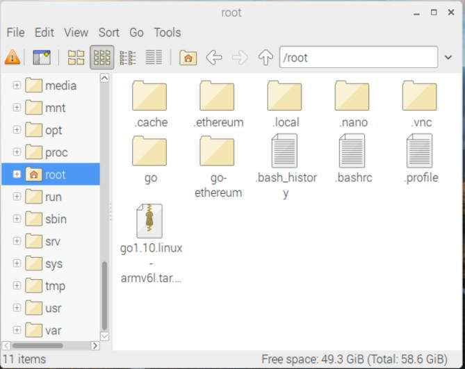

[ [Intro](README.md) ] -- [ [Set Up RasPi](pi_setup.md) ] -- [ [Install Go](go_install.md) ] -- [ [Install Geth](geth_install.md) ] -- [ [Run Geth](geth_run.md) ] -- [ **FAQ** ] -- [ [Updates](raspi_updates.md) ]

-----
- **Why is my blockchain data size smaller than what [BitInfoCharts](https://bitinfocharts.com/) tells me?**
 Because "fast sync" only gets block headers and block bodies. It processes no transactions until current block - 1024.Then it gets a snapshot state and goes like a full synchronization. TL;DR you will still get a copy of the whole blockchain with "fast sync". To learn more on this, I suggest googling "pruned vs. archived blockchain". Or go [here](https://github.com/ethereum/go-ethereum/pull/1889).

- **Where is the blockchain data stored?**
  By default, it is stored in `./ethereum` under `/root`. To access it, you will need to launch File Manager in super user mode with the command `sudo pcmanfm`.
 

-----
Next: [Updates >>](raspi_updates.md)
