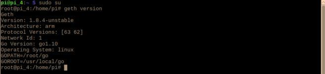

# Install Geth
[ [Intro](README.md) ] -- [ [Set Up RasPi](pi_setup.md) ] -- [ [Install Go](go_install.md) ] -- [ **Install Geth** ]  -- [ [Run Geth](geth_run.md) ] -- [ [FAQ](faq.md) ] -- [ [Updates](raspi_updates.md) ]

-----
## Build Geth from source code
Since we already have Go installed, we can easily bulid Geth by running the following commands:
- Download the project. Also checkout the default version of Go Ethereum into local `GOPATH` work space
   `sudo go get -d github.com/ethereum/go-ethereum`
- Build executables `go install github.com/ethereum/go-ethereum/cmd/geth`

## Alternative method --- Install via PPAs (not recommended)
Alternatively, you can install Geth directly via PPAs (Personal Package Archives)
- Enable Go Ethereum launchpad repository `sudo add-apt-repository -y ppa:ethereum/ethereum`
- Install stable version of Go Ethereum
 `sudo apt-get update`
 `sudo apt-get install ethereum`
 or the unstable version if you wish to
 `sudo apt-get update`
 `sudo apt-get install ethereum-unstable`

## Test if Geth is correctly installed and working
- `sudo su`
- `geth version`
 

Next: [Run Geth >>](geth_run.md)
