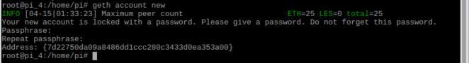
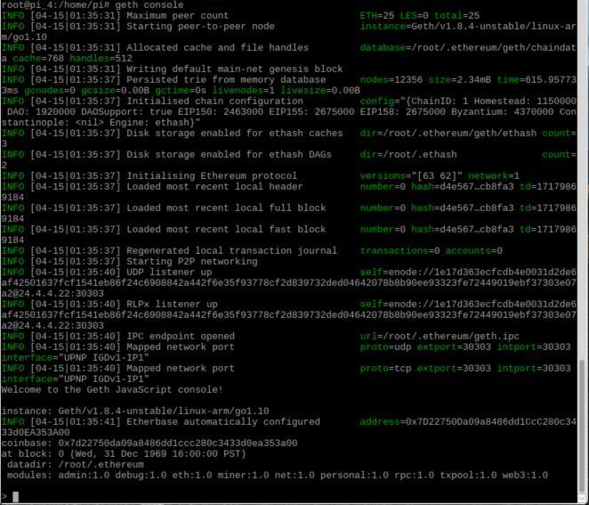

# Run Geth
[ [Intro](README.md) ] -- [ [Set Up RasPi](pi_setup.md) ] -- [ [Install Go](go_install.md) ] -- [ [Install Geth](geth_install.md) ] -- [ **Run Geth** ]   -- [ [Updates](raspi_updates.md) ]

-----
## Create a new account
**The account consists of an encrypted private key and the corresponding public key/address, all of which are stored in `~/.ethereum` by default**
- `sudo su`
- `geth account new`
Enter a passphrase twice for your new account when asked. **Make sure to remember this passphrase!!!**
 
## Run Geth Console
- `geth console`

After running this command, you should see messages as shown in the pic below.
 
 After some initial synchronisation process, you should see a command line interface where you can interact with. For example:
- To check synchronisation status  `eth.syncing`
This will give you current block number, and the highest block number being reported by your peers.

- To stop geth console  `exit`
## Run Geth in the backgrouod (optional)
- `geth --verbosity 0 &`

**Block synchronisation takes a few days so please be patient. Also expect hiccups while the node is catching up with the blocks. Imports might occasionally stop. Sometimes you might even run into runtime errors. During these times you will need to stop and restart the node.**

**In case where the blockchain database got corrupted, you would have to rebuild the block index. To do this, delete the blockchain data and start over. To avoid such headaches, I recommend downloading the whole blockchain onto a hard drive on a computer first, then copy the `chaindata` folder over onto the Pi.**
