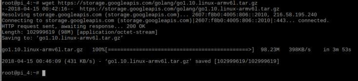
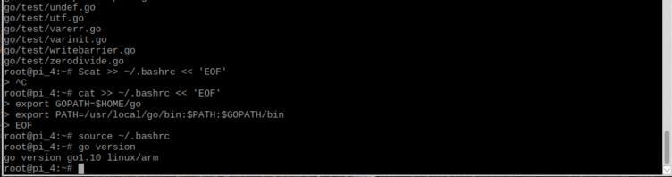

# Install Go
[ [Intro](README.md) ] -- [ [Set Up RasPi](pi_setup.md) ] -- [ **Install Go** ] -- [ [Install Geth](geth_install.md) ] -- [ [Run Geth](geth_run.md) ] -- [ [FAQ](faq.md) ] -- [ [Updates](raspi_updates.md) ]

-----
## Install security patches and application updates
- `sudo apt-get update`
- `sudo apt-get update -y`
- `sudo apt-get upgrade`
- `sudo apt-get install htop git curl bash-completion jq`
 **perform thecommands above regularly to make sure the system is always up-to-date**
## Install dependencies
- `sudo apt-get install libgmp3-dev -y`
## Install Golang 1.10 (latest release at the time of writing this tutorial)
- Download the archive `wget https://storage.googleapis.com/golang/go1.10.linux-armv6l.tar.gz`
- Extract it into /usr/local, creating a Go tree in /usr/local/go `sudo tar -C /usr/local -xvf go1.10.linux-armv6l.tar.gz`
- Load into current shell session `cat >> ~/.bashrc << 'EOF'`
    `export GOPATH=$HOME/go`
    `export PATH=/usr/local/go/bin:$PATH:$GOPATH/bin`
    `EOF`
- Run ~/.bashrc `source ~/.bashrc`
- Reboot `sudo shutdown -r now` 
## Test if Go is correctly installed and working
- `sudo su`
- `go version`

**Some screenshots for reference.**
 

## Unstall Golang
- `sudo apt remove golang`
- `sudo apt-get autoremove`
- `source .profile`
-----

Next: [Install Geth >>](geth_install.md)
