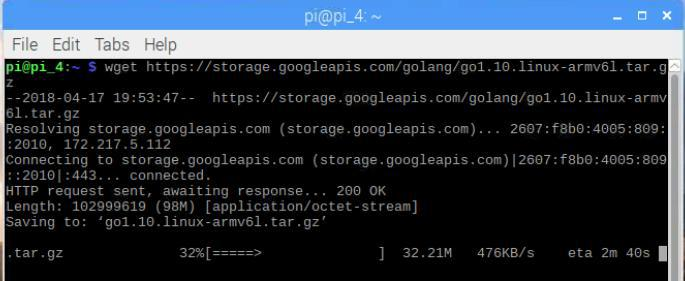
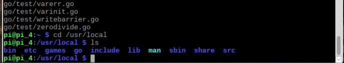
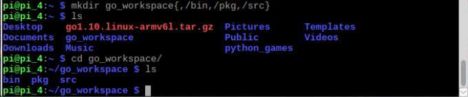
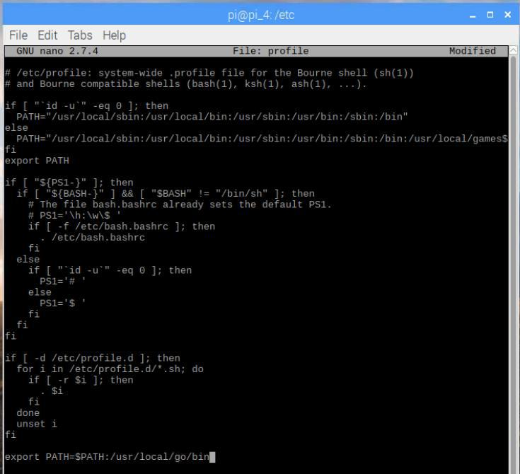
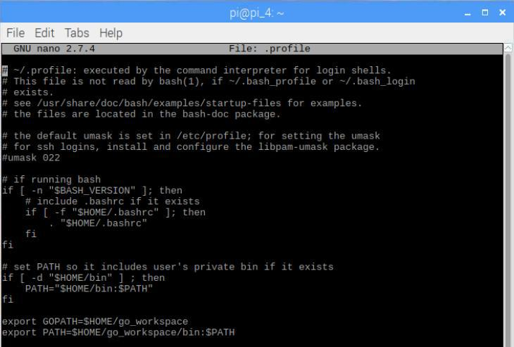
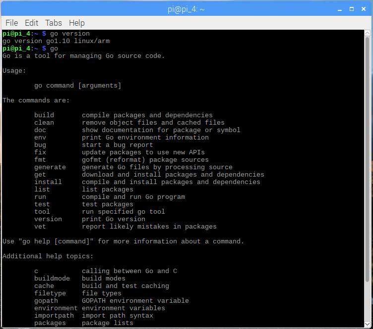

# Install Go
[ [Intro](README.md) ] -- [ [Set Up RasPi](pi_setup.md) ] -- [ **Install Go** ] -- [ [Install Geth](geth_install.md) ] -- [ [Run Geth](geth_run.md) ] -- [ [FAQ](faq.md) ] -- [ [Updates](raspi_updates.md) ]

-----
## Install security patches and application updates
- `$ sudo apt-get update`
- `$ sudo apt-get update -y`
- `$ sudo apt-get upgrade`
- `$ sudo apt-get install htop git curl bash-completion jq`
 **perform thecommands above regularly to make sure the system is always up-to-date**
## Install dependencies
- `$ sudo apt-get install libgmp3-dev -y`
## Install Golang 1.10 (latest release at the time of writing this tutorial)
- Download the archive `$ wget https://storage.googleapis.com/golang/go1.10.linux-armv6l.tar.gz`
 

- Extract it into /usr/local, creating a Go tree in /usr/local/go `$ sudo tar -C /usr/local -xvf go1.10.linux-armv6l.tar.gz`
 

- Change owner to root, and change permissions `$ sudo chown root:root /usr/local/go` `$ sudo chmod 755 /usr/local/go`
 

- Create a workspace folder, and 3 sub-folders inside it `$ mkdir <workspace_name>{,/bin,/pkg,/src}` *name it whatever you want, here I just named it `workspace`*
 

- Set environment variables
 ~ open up the file: `$ nano /etc/profile`
 ~ add this line to at the end of the file: `export PATH=$PATH:/usr/local/go/bin`
 
 `$ cd`
 ~ open up the file:`$ nano .profile`
 ~ add the following lines at the end of the file:
 `export GOPATH=$HOME/<workspace_name>`
 `export PATH=$HOME/<workspace_name>/bin:$PATH`
 
  
- Reboot `$ sudo shutdown -r now` 
## Test if Go is correctly installed and working
- `$ go version`
- `$ go env`

   
## Unstall Golang
- `$ sudo apt remove golang`
- `$ sudo apt-get autoremove`
- `$ source .profile`
-----

Next: [Install Geth >>](geth_install.md)
