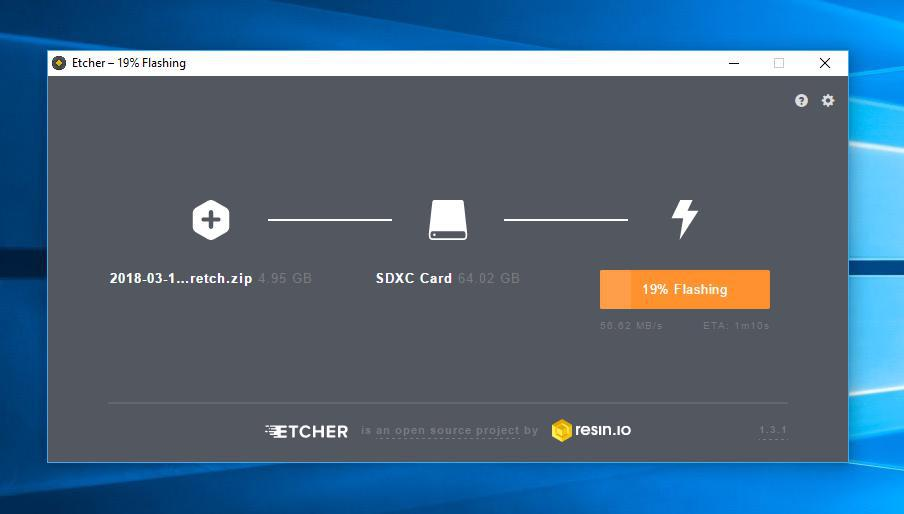
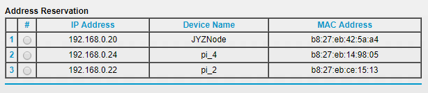
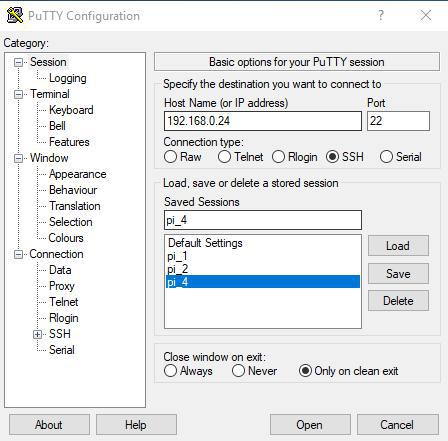
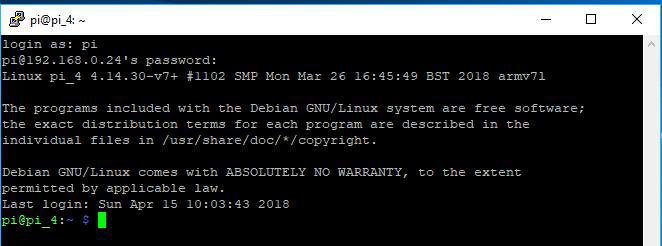
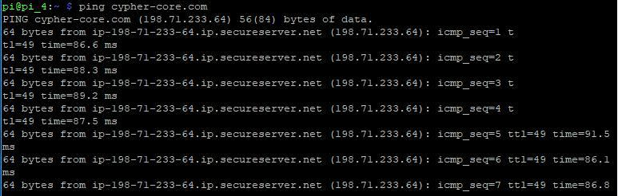
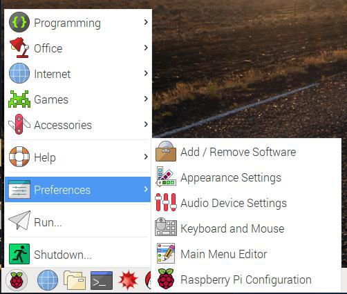
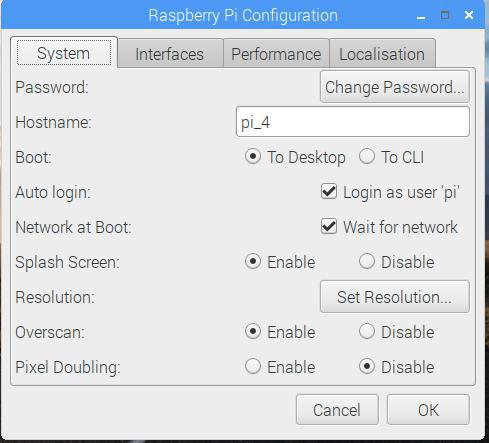
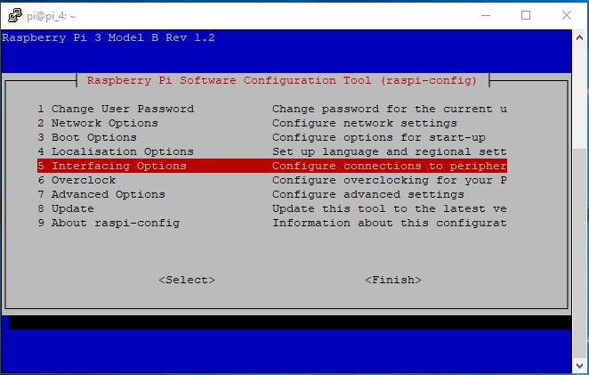

# Set up your pi
[ [Intro](README.md) ] -- [ **Set Up RasPi** ] -- [ [Install Go](go_install.md) ] -- [ [Install Geth](geth_install.md) ] -- [ [Run Geth](geth_run.md) ] -- [ [FAQ](faq.md) ] -- [ [Updates](raspi_updates.md) ]

-----
## Download and Load Raspbian disk image; Establish connection to the Pi
**Before proceeding to the next step, you first need to decide how you want to access your Pi for the intial setup process.**
1) Access locally. You will need the following thing(s):
    - a display
    - an HDMI cable
    - an ethernet cable (optional, you can also use wifi)
    - a wired mouse or a wireless mouse w/ a receiver
    - a wired keyword or a wireless keyboard (w/ a receiver or bluetooth)
    - a comupter to write the disk image to microSD card with

2) Access remotely (via SSH) aka "headless". You will need the following thing(s):
    - a computer to write the disk image to microSD card with, and to run Secure Shell (SSH) client on
    - assuming the computer has all necessary peripherals i.e. mouse, keyboard
    - an ethernet cable (optional, you can also use wifi)

**For this tutorial, I set up mine locally and used a VNC Viewer to access the Pi remotely from my main PC.**

### 1) Access Locally ###
**Your Raspbery Pi may come with a microSD card with NOOBS preloaded. In such case, simply insert the microSD card into the card slot on your Pi.**
* Download the latest [Raspbian Stretch With Desktop](https://www.raspberrypi.org/downloads/raspbian/) disk image
* Download the latest [Etcher](https://etcher.io/) and install it (for flashing Raspbian disk image to the microSD card)
* Insert the microSD card into the computer (you might need a microSD card adapter for this)
* Start Etcher program, and select the the microSD card you wish to flash the disk image file (either .img or .zip would work) to
* Double check your hard drive selection, then hit "Flash"



Once finished, eject the microSD card and insert it into the Raspberry Pi. Plug in all the peripherals (i.e. display, mouse, keyboard etc.). Finally, plug in the power adapter and wait for the Pi to boot up. If everyting went well, you should be welcomed with the default Raspbian desktop on the screen. You can now go ahead and set up wifi connection etc.

### 2) Access Remotely via SSH ###
* Download the latest [Raspbian Stretch With Lite](https://www.raspberrypi.org/downloads/raspbian/) disk image
* Download the latest [Etcher](https://etcher.io/) and install it (for flashing Raspbian disk image to the microSD card)
* Insert the microSD card into the computer (you might need a microSD card adapter for this)
* Start Etcher program, and select the the microSD card you wish to flash the disk image file (either .img or .zip would work) to
* Double check your hard drive selection, then hit "Flash"

**Now we need to establish SSH connection on the Pi**
* Go to the root directory of the microSD card, and creat an empty file named `ssh` without a file extension. This will automatically enable ssh upon booting up.
* Connect an ethernet cable to the Pi. If you wish to use wifi connection instead, create a file named `wpa_supplicant.conf` in the root directory of the microSD card, and write the following content:
```
country=US
ctrl_interface=/var/run/wpa_supplicant GROUP=netdev
update_config=1
network={
    ssid="SSID"
    psk="passwrod"
}
```
**Replace `US` with the ISO Alpha-2 code of the country you are located in. You can look it up [here](http://www.nationsonline.org/oneworld/country_code_list.htm).**
**Also replace `SSID` and `password` with your own wifi credentials**

Once finished, eject the microSD card and insert it into the Raspberry Pi. Plug in the power adapter and wait for the Pi to boot up. If everyting went well, you should see one red led light staying on and one green led light flashing steadily.

Next, we want to assign the Pi a static IP address so that we don't have to constantly change it for future SSH logins.
* Access your router by following this [guide](https://wiki.amahi.org/index.php/Find_Your_Gateway_IP)
* Find the corresponding menu for assigning static IP addresses
* Change the last part of the Pi's IP address to any number in the range of 0-255 (e.g. `24` for pi_4) 


Lastly, we need to run an SSH client to remotely access the Pi with. Personlly I use [PuTTY](edgebase/finding-your-default-gateway/) on Windows. If you use Mac OS or Linux, first you will need to open up Terminal. Type in `ssh pi@ip_address` and hit Return key when finished. When asked for password, enter `raspberry` and you will be in.




To test the internet connection on the Pi, run `ping cypher-core.com` in terminal. If you see pings, that means it's working.



## Configure the Pi
**Here are a few settings you can configure to optimized the Pi for our use.**
- Change user password
- Change Host name
- Manage network connections
- Update configuration tools
- Boot options 
    * -> Desktop / CLI -> CLI
    * -> wait for network to boot
- Localisation
- Overclock
- Advanced options 
    * -> Expand Filesystem
    * -> set Memory Split to `16`

To access these menus, simply go to `Preferences -> Raspberry Pi Configuration` if you are accessing the Pi via a display.

 

If you are running the Pi "headless", type in `sudo raspi-config`.



---

Next: [Install Go >>](go_install.md)
